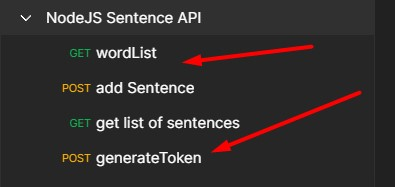
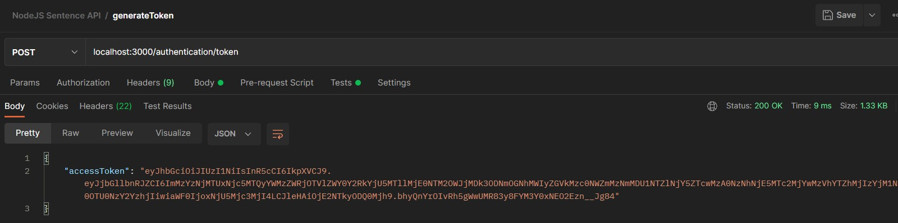
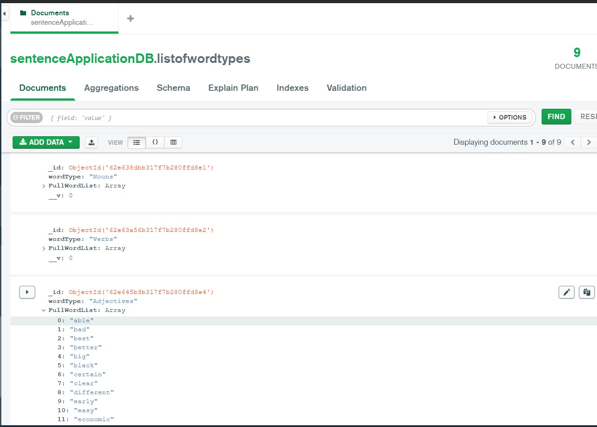

n security - token validation and generation of token
* Input validation with Express validator
* Error handling 
* Logging of HTTP calls 
* Response models
* Using Babel to use the latest import syntax 

## How to use and test this NodeJs Express application
1. Clone this repository.
2. Run npm install
5. Run the following command to start the application.: 'npm start'
6. Import the Postman collection into your Postman application (or API service of your choice) using the following link: https://www.getpostman.com/collections/ec33f93fabcd08cbf426
7. Generate a token. (You can change the token expiration time in the .env file)
8. Call the services that you would like to test. 

  

## JWT Authentication

  

## MongoDB

  

## ToDo / Improvement list

1. Swagger 
2. Jest validation
3. Docker Container
4. PM2 for load balancing
5. Load testing 